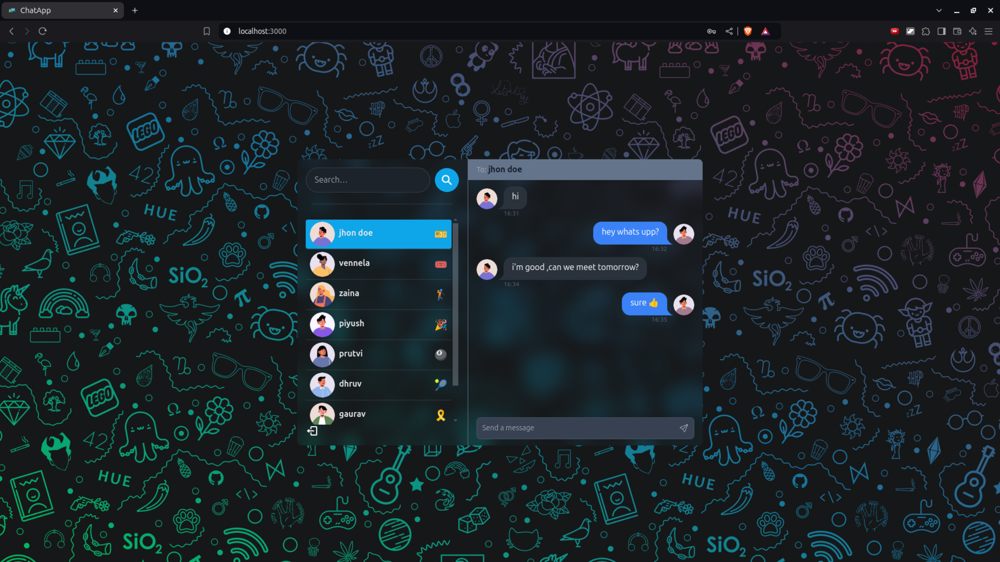
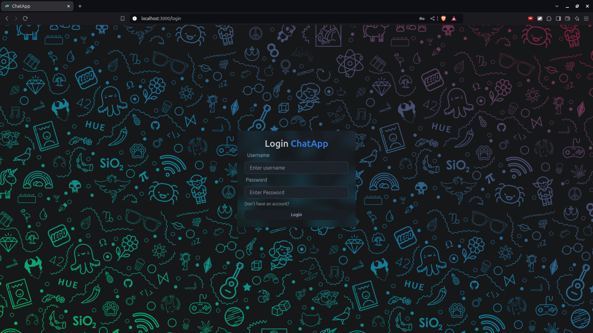
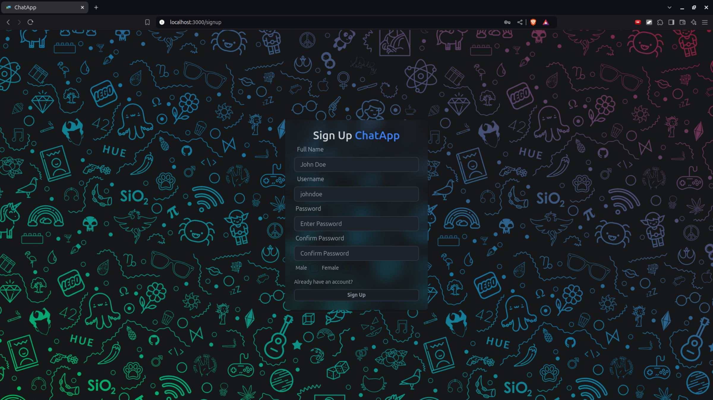

# MERN  Real Time Chat App | JWT, Socket.io
### Setup .env file

```js
PORT=...
MONGO_DB_URI=...
JWT_SECRET=...
NODE_ENV=...
```

### Build the app

```shell
npm run build
```

### Start the app

```shell
npm start
```
# My MERN Chat App
Here are some screenshots of the app:

## 1. Chat Page


## 2. Login Page



## 3. Signup Page



